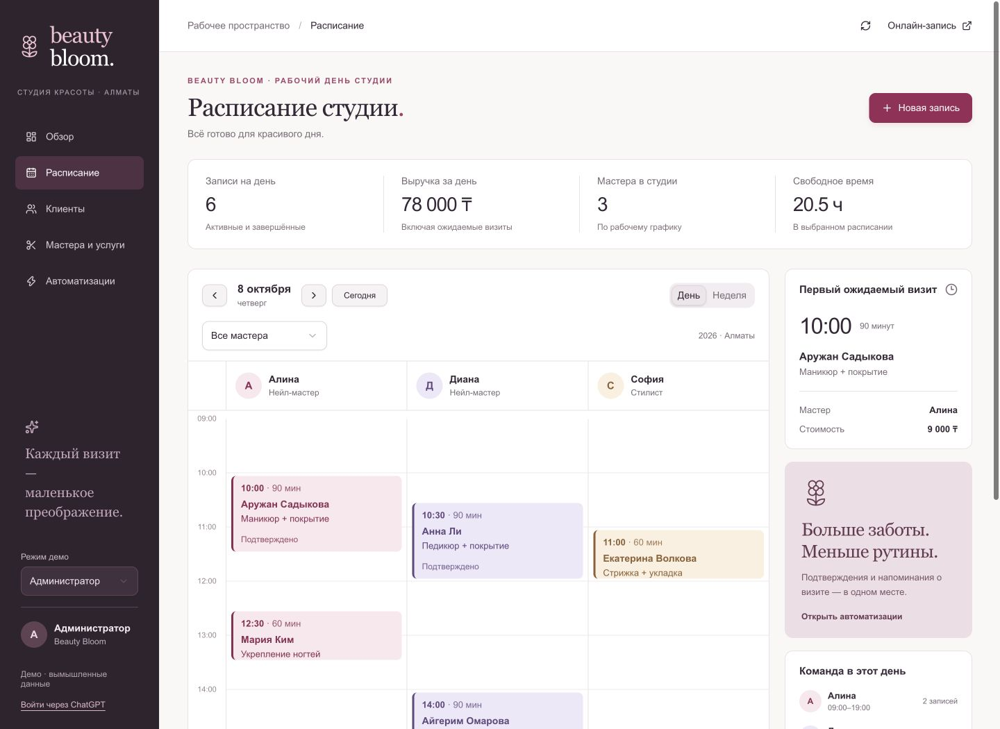

# Beauty Bloom CRM

Мини-CRM для студии маникюра и ухода за волосами: запись клиентов, расписание мастеров, история визитов, выручка и очередь уведомлений. Учебный проект для портфолио с работающим сервером и базой данных.

**[Открыть демо](https://beauty-bloom-crm.angrymunir.chatgpt.site)** · **[Кейс для портфолио](docs/PORTFOLIO.md)** · **[Архитектура](docs/ARCHITECTURE.md)** · **[Настройка n8n](docs/AUTOMATION.md)**



## Возможности

- Дневное и недельное расписание, фильтр мастера, рабочие часы и выходные.
- Создание, перенос, отмена и завершение визитов; защита от одновременного бронирования одного времени.
- Карточки клиентов с контактами, заметками, согласием на уведомления и историей.
- Управление мастерами, ценами и длительностью услуг. Старые визиты сохраняют цену и длительность на момент записи.
- Обзор выручки завершённых визитов, среднего чека, загрузки и услуг.
- Отдельная онлайн-запись со свободными интервалами. Ссылка из CRM ведёт в ту же студию.
- Подтверждение записи, напоминание за 24 часа, приглашение через 21 день для маникюра и 42 дня для волос.
- Демонстрация роли администратора и мастера с серверной проверкой выбранных прав.
- Вход через ChatGPT: первая студия привязывается к аккаунту, повторный вход возвращает её данные.

## Попробовать за две минуты

1. Нажмите **Новая запись**, выберите нового клиента, услугу, мастера и свободное время. Используйте вымышленные контакты.
2. Откройте визит в календаре. Перенесите его, затем отметьте завершённым.
3. Найдите клиента в **Клиентах** и посмотрите историю. В **Обзоре** проверьте выручку.
4. В **Автоматизациях** нажмите **Проверить в демо**: задачи изменят статус, писем отправлено не будет.
5. Переключитесь на роль мастера. Его расписание ограничено собственными визитами.

У каждого анонимного посетителя своя студия. Сессия действует 7 дней; для возвращения после её истечения войдите в аккаунт. Тестовые даты отсчитываются от первого открытия. Воскресенье — выходной. Интерфейс предусматривает адаптивную компоновку и прокрутку больших таблиц/календаря.

## Технологии

React 19, TypeScript, Vinext (Next.js App Router API поверх Vite), Cloudflare Workers + D1 (SQLite), Drizzle для схемы и миграций, Zod, Tailwind CSS, shadcn/ui и Lucide. Автоматизации: HTTP API и шаблон n8n.

## Локальный запуск

Нужны Node.js **>=22.13.0**, npm; Python 3 — для интеграционных проверок. macOS, Windows или Linux. Облачные ключи для локального запуска не нужны.

```sh
git clone https://github.com/Munirka/beauty-bloom-crm.git
cd beauty-bloom-crm
npm run install:ci
npm run build
npm run db:migrate:local
npm run dev
```

Откройте `http://127.0.0.1:5173`. База создаётся в игнорируемой `.wrangler/state`; тестовые данные заполняются при первом открытии студии. Миграция создаёт только схему. Для собранного Worker вместо dev используйте `npm start` и адрес из вывода.

Локально `/signin-with-chatgpt?return_to=/` использует тестовый аккаунт `local_seedy`, `/signout-with-chatgpt?return_to=/` выполняет выход. Имитация доступна только на loopback в dev и не попадает в production. На Sites авторизацией управляет платформа.

## Проверки

```sh
npm run typecheck
npm run lint
npm run build
# Пока npm run dev работает в другом терминале:
python3 tests/api_smoke.py
```

13 интеграционных тестов: сохранение данных, пересечение и конкурентное бронирование, перенос и устаревшая версия, отмена, повторный визит, права мастера, изоляция студий, приватность онлайн-записи, валидация/CSRF, очередь, фиксация цены и согласие клиента. Каждый тест создаёт отдельную локальную студию. Для другого локального порта задайте `BEAUTY_TEST_URL`.

## Границы демо

Роль можно свободно переключать для знакомства с проектом; для настоящего салона потребуется назначение ролей владельцем. Выручка отражает завершённые визиты, платежи не обрабатываются. Публичная онлайн-запись ограничена 50 визитами за сутки на студию и принимает email только `@example.com`.

Сервер хранит очередь автоматизаций. Внешний n8n и SMTP не подключены, доставка писем не проверена. Импортируемый workflow и инструкция предназначены для отдельной рабочей копии. Демонстрационная кнопка ничего не отправляет. Демо использует вымышленные контакты.

## Развёртывание

Этот экземпляр опубликован через Sites. `.openai/hosting.json` содержит его идентификатор и D1 binding `DB`. Для своей копии на Sites удалите поле `project_id` и зарегистрируйте новый сайт, сохранив binding и миграции. Публикуются сборка, миграции и точный Git-коммит. Скрипты `scripts/` обеспечивают переносимый запуск и инфраструктуру Sites.

Исходники: `app/`, `lib/`, `db/`; компоненты: `components/ui/`; миграции: `drizzle/`; автоматизация: `public/automation/`.
